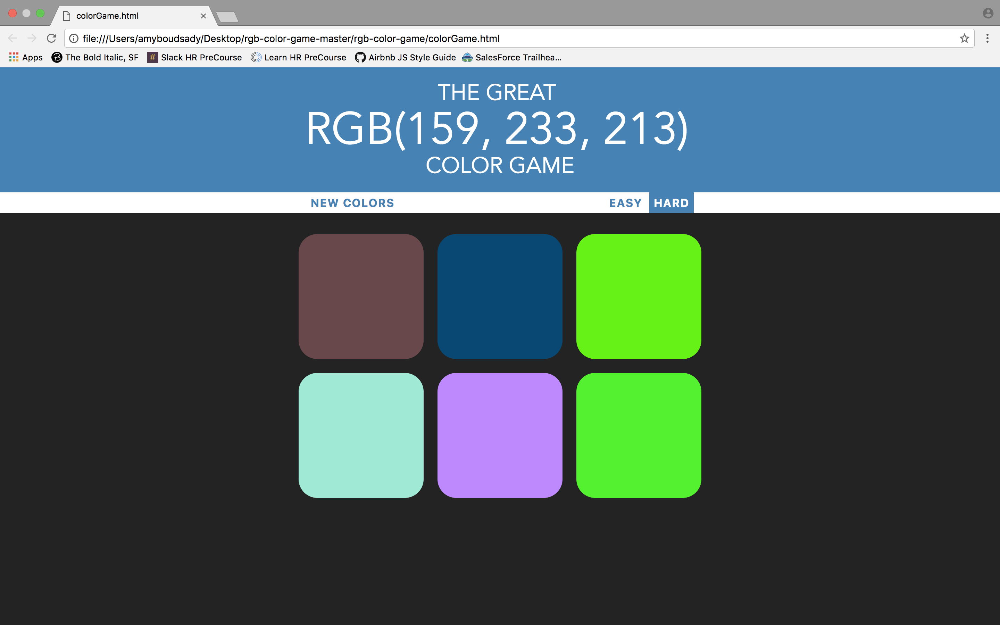

# RGB Color Game Project

A good tool to practice RGB colors because RGB systems are a bit unintuitive at first compared to most color systems that people are used to working with. So, let’s try to make learning it a little fun and challenging, yay! 

When you land on the page, you’ll get six random colors (they’re going to always change and be different. One of the color of the six, is lists in the large text above. Your goal is to find which of the six boxes below is that RGB color.

Remember, there are there channels: red, green and blue (each one ranges from 0 to 255).  With the mix of these three colors, we can pretty much make any color we want (black, white, yellow, orange, purple, etc. - all these are made with combining red, green, and blue - also called additive color mixing.

For example:

RBG(211, 206, 13)

R = 211
B = 206
G = 13

## Technology

* HTML, CSS, Responsive Design
* Lots of DOM manipulation and event handling
* JavaScript
* Start off with functionality and then styling after

<kbd></kbd>

## Play the Great RGB Color Game
http://greatrgbcolorgame.surge.sh/